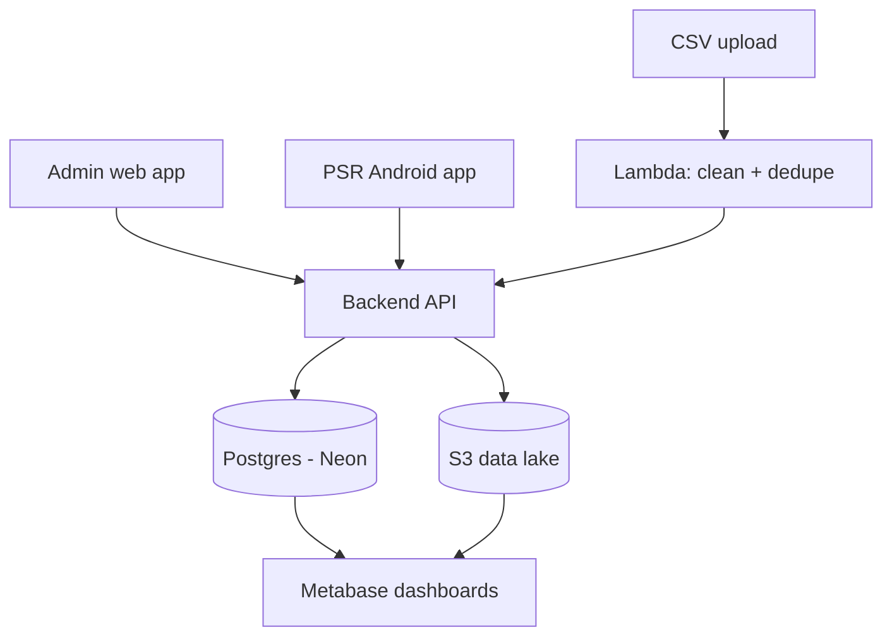

# Architecture

## Components

Two client apps, one backend, one operational database, one object store that doubles as the permanent audit lake. Nothing else is load-bearing.

## Auth flow

1. Web: agent/admin clicks "Sign in with Google" (Google Identity Services). Android: Credential Manager API pulls the account already on the phone.
2. Google returns a signed ID token (JWT) containing verified email, name, and a stable `sub` ID.
3. Backend verifies the token's signature against Google's public keys (`google-auth-library`), checks the `hd` claim against `ALLOWED_EMAIL_DOMAIN` if set, and looks up the email in the `users` table.
4. If found and active, backend mints its own short-lived JWT with the user's role (`admin` / `team_lead` / `agent`) baked in. This is the token used for every subsequent API call — Google is not re-contacted per request.
5. Every login is written to `audit_log`.

## Call event flow (PSR app)

1. Agent taps a contact in their assigned list.
2. App calls `TelecomManager.placeCall()`; the app's own `ConnectionService` intercepts it and renders the custom in-app call screen. The call itself goes out over the agent's real SIM — this is not VoIP.
3. State callbacks fire as the call progresses: `DIALING` → `RINGING` → `ACTIVE` → `DISCONNECTED`. Each transition is timestamped client-side.
4. On `DISCONNECTED`, the app computes `ring_duration_seconds` (`DIALING` → `ACTIVE`) and `talk_duration_seconds` (`ACTIVE` → `DISCONNECTED`) and POSTs the full event set for that call to the backend, authenticated with the agent's JWT.
5. Backend writes the event to Postgres (`call_events`, used for the live status board) and to S3 (append-only JSON, used as the permanent, tamper-proof record — S3 Object Lock means even an admin cannot edit or delete it after the fact).

## Ingestion flow (admin side)

1. Admin uploads a CSV in the admin web app. Backend issues a presigned S3 PUT URL; the file lands directly in S3, never touching the backend's memory.
2. An S3 event triggers a Lambda function (Python + pandas) that parses, cleans, and dedupes the rows.
3. The Lambda POSTs the cleaned rows in batches to the backend's internal `/internal/ingest` endpoint (protected by `SERVICE_TO_SERVICE_SECRET`), which writes them into the `contacts` table and records the upload in `upload_batches`.
4. Admin builds a dataset by filtering contacts (region, status, tags, last-called date) and assigns the resulting set to one or more agents — this writes rows into `assignments`.
5. Each agent's app syncs its assigned slice on next login/refresh.

## Audit and analytics

Two lenses on the same source of truth, never two separate truths:

- **Live**: admin dashboard polls (or subscribes via websocket to) a Postgres-backed endpoint for "who's on a call right now," refreshed every few seconds.
- **Historical / audit**: Metabase, pointed at a read-only Postgres role, gives drag-and-drop dashboards (call volume per agent, leaderboards) and ad-hoc SQL for anything specific. Recording playback fetches a short-lived presigned S3 URL per request — recordings are never publicly exposed and never deletable.
- A separate periodic Lambda archives `call_events` rows older than a configurable window out of Postgres into Parquet files in S3 (queryable later via DuckDB if ever needed), keeping the operational database lean and inside Neon's free-tier storage cap indefinitely.

## Why these choices (short version)

AWS is used only where it's billed per actual unit of usage with no compute floor (S3, Lambda) — never for the managed-cluster-shaped services (Glue, Athena, QuickSight, RDS) that charge for infrastructure regardless of how small the job is. Everything else is either free (Neon free tier, Google auth, Metabase) or a flat, predictable VPS cost. Nothing here is proprietary enough to cause migration pain later — Postgres is Postgres, S3's API is the de facto standard, and Docker containers run anywhere.
